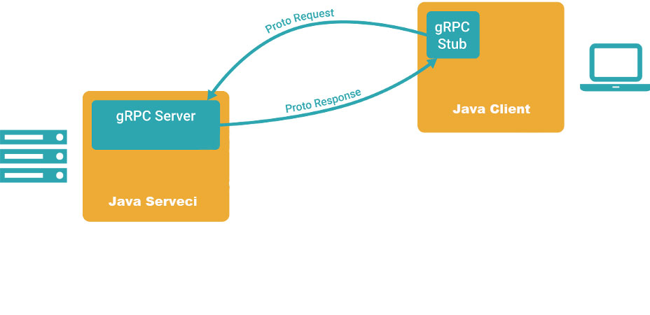

# Simple web Bookstore Management System.
This project is a Spring Boot application that uses gRPC services, Protocol Buffers, and MapStruct for Entity to DTO transformation. It includes two services: serveci-server and serveci-client. The serveci-server interacts with databases, while the serveci-client interacts with a web-client based on Spring WebFlux and Project Reactor. gRPC is used for calling methods in serveci-server.

## Technologies Used
- Spring Boot 2.7
- Gradle
- PostgreSQL
- Java 17
- MapStruct
- gRPC services
- Protocol Buffers

## Public IP
[amazon EC2 Public IP]
(http://ec2-52-59-208-61.eu-central-1.compute.amazonaws.com:5020/)

[swagger doc.](http://ec2-52-59-208-61.eu-central-1.compute.amazonaws.com:5020/swagger-ui/index.html)

## serveci-client Controller (BookController)
The serveci-client includes a controller named **BookController** that handles CRUD operations for books. Below are the methods in the controller with their descriptions:

## findAll 
http://ec2-52-59-208-61.eu-central-1.compute.amazonaws.com:5020/api/v1/books
- **Endpoint: /api/v1/books**
- **Method:** GET
- **Description:** Returns a list of all books.
- **Returns: Flux\<BookDTO\>** containing all books.
- **Logger Message:** Logs the retrieval of all books.

## findById
http://ec2-52-59-208-61.eu-central-1.compute.amazonaws.com:5020/api/v1/books/adbf41ac-1c4e-4562-b8a0-e09b78005bab
- **Endpoint: /api/v1/books/{bookId}**
- **Method:** GET
- **Description:** Finds a book by its ID.
- **Parameters:**
    - **bookId:** Path variable representing the ID of the book.
- **Returns: Mono\<BookDTO\>** representing the found book.
- **Logger Message:** Logs the retrieval of a book by ID.

## saveNewBook
http://ec2-52-59-208-61.eu-central-1.compute.amazonaws.com:5020/api/v1/books
- **Endpoint: /api/v1/books**
- **Method:** POST
- **Description:** Saves a new book.
- **Request Body: Mono\<BookDTO\>** containing the details of the new book.
    - **Note**: The `id` field in `BookDTO` is automatically generated and does not need to be provided. 
- **Returns: Mono\<BookDTO\>** representing the saved book.
- **Logger Message:** Logs the saving of a new book.

## updateBookFields
http://ec2-52-59-208-61.eu-central-1.compute.amazonaws.com:5020/api/v1/books
- **Endpoint: /api/v1/books**
- **Method:** PATCH
- **Description:** Updates fields of an existing book. The method can change one field or multiple fields simultaneously. The main requirement is that the `id` field must be filled.
- **Request Body: Mono\<BookDTO\>** containing the updated details of the book.
- **Returns: Mono\<BookDTO\>** representing the updated book.
- **Logger Message:** Logs the updating of book fields.

## deleteBook
http://ec2-52-59-208-61.eu-central-1.compute.amazonaws.com:5020/api/v1/books/446a22b6-13aa-4722-bde7-bf0ce2713bb7
- **Endpoint: /api/v1/books/{bookId}**
- **Method:** DELETE
- **Description:** Deletes a book by its ID.
- **Parameters:**
    - **bookId:** Path variable representing the ID of the book to delete.
- **Returns: Mono\<String\>** containing a message confirming the deletion.
- **Logger Message:** Logs the deletion of a book by ID.

## BookDTO
- **Fields**:
    - `id` (UUID)
    - `title` (String)
    - `author` (String)
    - `isbn` (String)
    - `quantity` (Integer)
  
## Validation in BookDTO
The BookDTO class includes validation annotations to ensure data integrity when saving a new book. Here are the validations applied:

- **title:** Cannot be empty and must be between 3 and 30 characters using only letters and spaces.
- **author:** Cannot be empty and must be between 3 and 30 characters using only letters and spaces.
- **isbn:** Cannot be empty.
- **quantity:** Cannot be empty or null and must be a non-negative integer.
